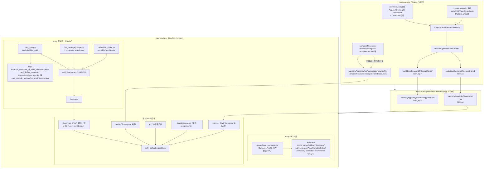

# CMP Hello World

[English](./README.md) | 简体中文

**版本信息**

| 组件 | 版本 |
| --- | --- |
| Kotlin | 2.2.21-0.1.0 |
| Compose Multiplatform | 1.9.2-OH.0.1.2-17 |
| Gradle | 8.9（见 wrapper） |
| Android Gradle Plugin | 8.6.0 |
| Android SDK | Compile 36 / Min 24 / Target 36 |

面向 **Android**、**iOS** 和 **鸿蒙（HarmonyOS）** 的 Kotlin 多平台 + Compose 多平台最小示例。共享 UI 包含「Click me!」按钮，点击后切换显示平台问候语和 Compose logo 图片（如鸿蒙上显示「HarmonyOS」）。

**功能要点**

- **共享 UI**：`composeApp/src/commonMain` 下同一套 Compose 代码（Material3 主题、Button、AnimatedVisibility、Image、Text）。
- **各平台入口**：Android（`MainActivity`）、iOS（`MainViewController` + SwiftUI `ContentView`）、鸿蒙（`MainArkUIViewController` + ArkTS `Compose`）。
- **资源**：Compose 多平台资源（`composeResources/`）通过 Gradle 任务按动态路径拷贝到鸿蒙应用的 rawfile，保证 OHOS 上 `painterResource` 能正确解析 drawable。

**相关文档**

- `docs/06-OHOS-Navigation-SavedStateHandle回传验证.md`：OHOS `SavedStateHandle` 回传 Demo 的三方库用法、测试步骤和官方链接。

**目录结构**

- `composeApp/src/commonMain/kotlin/com/example/cmp_hello/`
  - `App.kt`：根 Composable（按钮、问候语、图片）。
  - `Greeting.kt`：通过 `getPlatform().name` 生成问候文案。
  - `Platform.kt`：`expect fun getPlatform(): Platform`。
- `composeApp/src/androidMain/.../MainActivity.kt`：Android 入口。
- `composeApp/src/iosMain/.../MainViewController.kt`：iOS Compose 控制器。
- `composeApp/src/ohosArm64Main/.../MainArkUIViewController.kt`：鸿蒙入口，导出 `MainArkUIViewController(env)` 供 ArkTS 调用。
- `composeApp/src/commonMain/composeResources/drawable/`：`painterResource` 使用的 drawable（如 `compose-multiplatform.xml`）。
- `harmonyApp/`：DevEco Studio 工程；通过 Gradle 拷贝任务接收 `libkn.so`、头文件和 compose 资源。
- `iosApp/`：Xcode 工程；SwiftUI 中桥接 `MainViewController()`。

**构建与运行**

- **Android**
  ```bash
  ./gradlew :composeApp:assembleDebug
  ```
  在 Android Studio 中运行或安装生成的 Debug APK。

- **iOS**  
  使用 IDE 运行配置，或打开 `iosApp` 用 Xcode 运行。

- **鸿蒙（HarmonyOS）**
  1. 将共享库与资源发布到鸿蒙工程目录：
     ```bash
     ./gradlew :composeApp:publishDebugBinariesToHarmonyApp
     ```
  2. 用 DevEco Studio 打开 `harmonyApp` 目录。
  3. 同步工程后在鸿蒙设备或模拟器上运行。

  该任务会把 `libkn.so`、`libkn_api.h` 以及 `composeApp/src/commonMain/composeResources` 拷贝到 `harmonyApp`，资源路径为 `rawfile/composeResources/{rootProject.name}.{project.name}.generated.resources/`，与运行时约定一致。

### OHOS 编译打包流程概览

从 composeApp 的源码与资源，到 harmonyApp 的 HAP 安装包，整体流程如下（含产物与 NAPI 初始化关系）：



**说明**：

- **composeApp**：Kotlin/Native 将 commonMain + ohosArm64Main 编译并链接为 **libkn.so**，同时生成 **libkn_api.h**（导出 `MainArkUIViewController` 等 C 接口）。**composeResources** 不参与编译，仅作为目录在 Copy 阶段拷贝。
- **Copy 任务**：把 libkn.so、libkn_api.h、composeResources 按约定路径拷贝到 harmonyApp，供后续 CMake 与运行时使用。
- **harmonyApp**：**libentry.so** 由 CMake 编译 `napi_init.cpp` 得到，链接 **libkn.so**（IMPORTED）与 **compose::skikobridge**；`napi_init.cpp` 在 `Init()` 中调用 `androidx_compose_ui_arkui_init(env, exports)` 并注册 `MainArkUIViewController` 等 NAPI 方法，模块名为 `"entry"`。ArkTS 通过 `import 'libentry.so'` 拿到该 NAPI 模块，调用 `MainArkUIViewController()` 获得控制器，再交给 **compose.har** 提供的 `Compose({ libraryName: 'entry' })` 渲染。最终 HAP 内包含 libentry.so、libkn.so、libskikobridge.so 以及 rawfile 中的 compose 资源。

**依赖说明**

- Compose Runtime / Foundation / UI / Material / Material3 及 Compose 资源均在 `composeApp/build.gradle.kts` 的 `commonMain` 中配置。
- 鸿蒙端：`compose.multiplatform.export`、OHOS 版 Skiko（如 `0.9.22.2-OH.0.1.2-07`），以及 build 中强制的 export/ui/foundation 版本。

### 自渲染与统一渲染切换

鸿蒙上 Compose 支持两种渲染模式，在 `composeApp/build.gradle.kts` 的 `compose { ohos { ... } }` 里**二选一**，不能同时启用：

| 模式     | 配置                     | 说明 |
|----------|--------------------------|------|
| **自渲染** | `skia("0.9.22.2-OH.0.1.2-07")` | 使用 Skia 自绘，当前默认。 |
| **统一渲染** | `ohrender("0.9.22.2-ohrende")` | 走 ArkUI 统一渲染管线。 |

**切换步骤**：注释掉当前启用的一行，取消另一行的注释。例如要改为统一渲染：

```kotlin
compose {
    ohos {
        // skia("0.9.22.2-OH.0.1.2-07")
        ohrender("0.9.22.2-ohrende")
    }
}
```

修改后需重新执行 `./gradlew :composeApp:publishDebugBinariesToHarmonyApp` 并重新用 DevEco 打 HAP。

---

## 鸿蒙常见问题与解决

### 1. 启动或进入 Compose 页崩溃：`ArkUIViewController_setId` 或「Not mapped」

**现象**：应用一启动或打开 Compose 页面即崩溃，日志中出现 `ArkUIViewController_setId`、`Not mapped` 或与 `libComposeApp.so` / `libkn.so` 相关错误。

**原因**：Native 层 `napi_init.cpp` 未正确加载 Compose 初始化函数（`androidx_compose_ui_arkui_init` 或 `androidx_compose_ui_arkui_utils_init`）；或 ArkUI 控制器在 Native 模块未就绪时创建、或未正确设置 `libraryName`。

**解决**：

1. **`napi_init.cpp`**：解析初始化符号时做兼容，例如先用 `dlsym(RTLD_DEFAULT, "androidx_compose_ui_arkui_utils_init")`，若为空再试 `androidx_compose_ui_arkui_init`，对非空函数指针进行调用。
2. **ArkTS 页面**：在 `aboutToAppear` 中调用 `nativeApi.MainArkUIViewController()`（可加 try/catch），将返回的 controller 传给 `Compose`。
3. **Compose 组件**：在 `Compose` 调用处设置 `libraryName: 'entry'`（或你的动态库名）。

### 2. 点击「Click me!」后崩溃（如 SIGABRT / Uncaught Kotlin exception）

**现象**：点击按钮后应用崩溃，日志为「Uncaught Kotlin exception」，发生在 `libkn.so`。

**原因**：多为在 OHOS 上 `painterResource(Res.drawable.xxx)` 加载失败，Compose 资源未按运行时期望的路径部署。

**解决**：确保 publish 任务把 compose 资源拷贝到鸿蒙 rawfile，且路径前缀与生成代码一致：`composeResources/{rootProject.name}.{project.name}.generated.resources/`。本工程的 `publish*BinariesToHarmonyApp` 已按该规则动态生成路径；若修改了 `rootProject.name` 或 composeApp 模块名，需重新执行该任务。

### 3. 构建报错：input file does not exist（`:cinteropResourceOhosArm64`）

**原因**：`build.gradle.kts` 中 `resource.def` 的路径与实际文件位置不一致。

**解决**：将 def 文件放在 `composeApp/src/ohosArm64Main/cinterop/resource.def`，并在 `resource` cinterop 中保持 `defFile(file("src/ohosArm64Main/cinterop/resource.def"))`。

### 4. 依赖 / 变体冲突或 403 Forbidden

**原因**：部分 AndroidX（如 lifecycle、savedstate）等与 OHOS 目标不完全兼容，或仓库权限导致解析失败。

**解决**：在 `composeApp/build.gradle.kts` 中用 `configurations.all { resolutionStrategy { ... } }` 固定所需版本，必要时对 OHOS 相关配置做 `exclude(group = "...")`。本示例已对 Compose export/ui/foundation 做了 OHOS 版本强制。

---

## Gradle 构建提示

- **Unresolved reference `libs.xxx`**：在 `gradle/libs.versions.toml` 的 `[libraries]` 或 `[plugins]` 中定义对应别名，且拼写一致（Gradle 将 `-` 转为 `.`，如 `compose-multiplatform-export` → `libs.compose.multiplatform.export`）。
- **Skiko / 鸿蒙渲染**：若在鸿蒙上出现与 Skiko 相关的崩溃，可在 `compose { ohos { skia("...") } }` 和/或 `resolutionStrategy` 中固定为 OHOS 适配版本（如 `0.9.22.2-OH.0.1.2-07`）。

---

了解更多：[Kotlin Multiplatform](https://www.jetbrains.com/help/kotlin-multiplatform-dev/get-started.html)。
