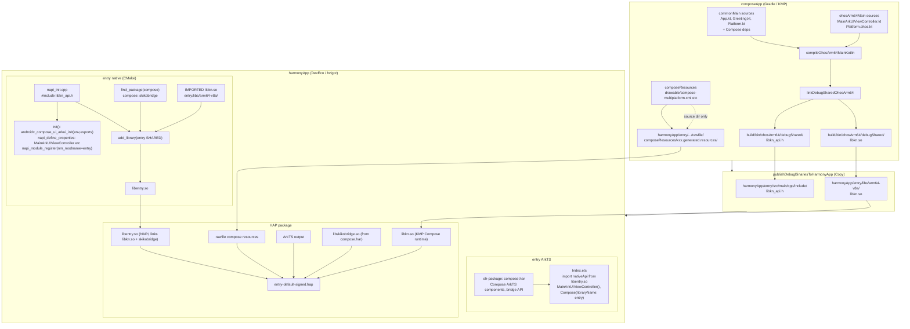

# CMP My Compose

## 核心框架

| 层次 | 技术 | 版本 |
|---|---|---|
| 多平台语言 | Kotlin Multiplatform (KMP) | `2.2.21-0.1.0` (OHOS fork) |
| 共享 UI | Compose Multiplatform | `1.9.2-OH.0.1.2-17` (OHOS fork) |
| UI 规范 | Material Design 3 | `1.9.2-OH.0.1.2-09` |
| 构建系统 | Gradle + AGP | `8.9` / `8.6.0` |

---

## 目标平台

| 平台 | 入口 | 渲染方式 |
|---|---|---|
| Android | `MainActivity` | Compose Android |
| iOS | `MainViewController` (SwiftUI bridge) | Compose UIKit |
| HarmonyOS arm64 | `MainArkUIViewController` (ArkTS NAPI bridge) | Skia 自渲染 / 统一渲染可切换 |

---

## 网络层

**Ktor** `3.3.3-0.0.1-rc1` — 多平台 HTTP 客户端

| 目标 | 引擎 |
|---|---|
| Android | `ktor-client-okhttp` |
| iOS | `ktor-client-darwin` |
| OHOS | `ktor-client-curl-ohosarm64` |

插件：Content Negotiation · kotlinx.serialization JSON · Logging

---

## 图片加载

**Coil 3** `3.3.0-0.0.1-rc1`

- `coil-core` — 核心引擎
- `coil-compose` — Compose 集成
- `coil-network-ktor3` — 网络后端（基于 Ktor）

---

## 导航

**Jetpack Navigation Compose** `2.9.4-0.1.1`

KMP 版本，支持 Android / iOS / OHOS 三端共享导航图。

---

## 数据 / 序列化

| 库 | 版本 | 用途 |
|---|---|---|
| `kotlinx.serialization` | `1.9.1-OH-004` | JSON 序列化 |
| `kotlinx.datetime` | `0.7.1-OH-001` | 跨平台日期时间 |
| `kotlinx.io` | `0.9.0-OH-001` | 跨平台 IO |
| `kotlinx.coroutines` | `1.10.2-OH-103` | 协程 |
| `atomicfu` | `0.31.0-OH-001` | 原子操作 |

---

## 加密 / 编码

| 库 | 版本 | 用途 |
|---|---|---|
| `kotlincrypto/hash` SHA-1 + MD | `0.8.0-0.0.1-rc1` | 哈希计算 |
| `matthewnelson/encoding` Base64 | `2.5.0-0.0.1-rc1` | Base64 编解码 |

---

## OHOS 特有组件

| 组件 | 说明 |
|---|---|
| `compose.multiplatform.export` | 将 Compose 运行时导出为 `.so` 供 ArkTS 调用 |
| Skiko `0.9.22.2-OH.0.1.2-07` | OHOS 版 Skia 渲染引擎 |
| C interop (`resource.def`) | 访问鸿蒙 rawfile 资源管理器（`raw_file_manager.h`） |
| NAPI bridge (`napi_init.cpp`) | 注册 `MainArkUIViewController` 等方法供 ArkTS 调用 |

---

## 自定义解决方案

**`AppIcons`** (`core/ui/AppIcons.kt`)

用纯 `ImageVector` path 实现的图标集，替代 `material-icons-extended`。原因：`material-icons-extended` 官方版本无 `ohos_arm64` 变体，无法在 OHOS native 目标上解析。

---

## 依赖分发

所有核心依赖均使用 **OHOS 定制 fork 版本**（版本号带 `-OH-` 或 `-0.0.1-rc1` 后缀），由私有 Nexus 仓库统一分发：

```
https://maven.eazytec-cloud.com/nexus/repository/maven-public/
```

涵盖 Kotlin、Compose Multiplatform、Ktor、Coil、kotlinx 全系列。与上游 JetBrains / Google 版本不直接兼容，是当前 KMP 支持鸿蒙的必要代价。


English | [简体中文](./README-zh_CN.md)

**Version Information**

| Component | Version |
| --- | --- |
| Kotlin | 2.2.21-0.1.0 |
| Compose Multiplatform | 1.9.2-OH.0.1.2-17 |
| Gradle | 8.9 (see wrapper) |
| Android Gradle Plugin | 8.6.0 |
| Android SDK | Compile 36 / Min 24 / Target 36 |

A minimal Kotlin Multiplatform + Compose Multiplatform sample targeting **Android**, **iOS**, and **HarmonyOS**. Shared UI includes a “Click me!” button that toggles a greeting and a Compose logo image, with platform-specific labels (e.g. “HarmonyOS” on OHOS).

**Features**

- **Shared UI**: Single Compose codebase in `composeApp/src/commonMain` (Material3 theme, Button, AnimatedVisibility, Image, Text).
- **Platform entry points**: Android (`MainActivity`), iOS (`MainViewController` + SwiftUI `ContentView`), HarmonyOS (`MainArkUIViewController` + ArkTS `Compose`).
- **Resources**: Compose Multiplatform resources (`composeResources/`) are copied into the Harmony app’s rawfile with a dynamic path so `painterResource` can resolve drawables on OHOS.

**Directory Structure**

- `composeApp/src/commonMain/kotlin/com/example/cmp_hello/`
  - `App.kt` – Root Composable (button, greeting, image).
  - `Greeting.kt` – Uses `getPlatform().name` for the greeting text.
  - `Platform.kt` – `expect fun getPlatform(): Platform`.
- `composeApp/src/androidMain/.../MainActivity.kt` – Android entry.
- `composeApp/src/iosMain/.../MainViewController.kt` – iOS Compose controller.
- `composeApp/src/ohosArm64Main/.../MainArkUIViewController.kt` – OHOS entry, exports `MainArkUIViewController(env)` for ArkTS.
- `composeApp/src/commonMain/composeResources/drawable/` – Drawable used by `painterResource` (e.g. `compose-multiplatform.xml`).
- `harmonyApp/` – DevEco Studio project; receives `libkn.so`, headers, and compose resources via Gradle copy tasks.
- `iosApp/` – Xcode project; SwiftUI bridges to `MainViewController()`.

**Build & Run**

- **Android**
  ```bash
  ./gradlew :composeApp:assembleDebug
  ```
  Run from Android Studio or install the debug APK.

- **iOS**  
  Use the IDE run configuration, or open `iosApp` in Xcode and run.

- **HarmonyOS**
  1. Publish shared library and resources to the Harmony app directory:
     ```bash
     ./gradlew :composeApp:publishDebugBinariesToHarmonyApp
     ```
  2. Open the `harmonyApp` folder in DevEco Studio.
  3. Sync and run on a HarmonyOS device or emulator.

  The task copies `libkn.so`, `libkn_api.h`, and `composeApp/src/commonMain/composeResources` into `harmonyApp` so that the runtime can load Compose and drawables (path: `rawfile/composeResources/{rootProject.name}.{project.name}.generated.resources/`).

### OHOS build and package flow

From composeApp sources and resources to the harmonyApp HAP, the flow is:



**Notes:** **composeApp** produces **libkn.so** and **libkn_api.h** (Kotlin/Native); **composeResources** are copied as-is. The **Copy** task writes them into `harmonyApp`. **harmonyApp** builds **libentry.so** from `napi_init.cpp` (linking libkn.so and compose::skikobridge), registers NAPI with `androidx_compose_ui_arkui_init` and `MainArkUIViewController` (module name `"entry"`). ArkTS imports `libentry.so`, gets the controller, and uses **compose.har**’s `Compose({ libraryName: 'entry' })`. The HAP contains libentry.so, libkn.so, libskikobridge.so, and rawfile resources.

**Dependencies**

- Compose Runtime / Foundation / UI / Material / Material3 and Compose resources are in `composeApp/build.gradle.kts` under `commonMain`.
- OHOS: `compose.multiplatform.export`, Skiko for OHOS (e.g. `0.9.22.2-OH.0.1.2-07`), and forced export/ui/foundation versions as in the build file.

### Switching between self-rendering and unified rendering

On OHOS, Compose supports two rendering modes. In `composeApp/build.gradle.kts` under `compose { ohos { ... } }` you must **enable exactly one**:

| Mode | Config | Description |
|------|--------|-------------|
| **Self-rendering** | `skia("0.9.22.2-OH.0.1.2-07")` | Skia-based rendering (default). |
| **Unified rendering** | `ohrender("0.9.22.2-ohrende")` | Uses ArkUI unified rendering pipeline. |

**To switch**: Comment out the active line and uncomment the other. Example for unified rendering:

```kotlin
compose {
    ohos {
        // skia("0.9.22.2-OH.0.1.2-07")
        ohrender("0.9.22.2-ohrende")
    }
}
```

After changing, run `./gradlew :composeApp:publishDebugBinariesToHarmonyApp` again and rebuild the HAP in DevEco Studio.

---

## HarmonyOS common issues & solutions

### 1. Runtime crash: `ArkUIViewController_setId` or “Not mapped”

**Symptom**: App crashes on launch or when opening the Compose page; logs mention `ArkUIViewController_setId`, `Not mapped`, or `libComposeApp.so` / `libkn.so`.

**Cause**: Native `napi_init.cpp` not loading Compose init (`androidx_compose_ui_arkui_init` or `androidx_compose_ui_arkui_utils_init`), or ArkUI controller created before the native module is ready / wrong `libraryName`.

**Solution**:

1. **`napi_init.cpp`**: Use a fallback when resolving the init symbol, e.g. try `androidx_compose_ui_arkui_utils_init` then `androidx_compose_ui_arkui_init` with `dlsym(RTLD_DEFAULT, ...)` and call the non-null one.
2. **ArkTS page**: In `aboutToAppear`, call `nativeApi.MainArkUIViewController()` (with try/catch) and pass the returned controller to `Compose`.
3. **Compose component**: Set `libraryName: 'entry'` (or your dynamic library name) in the `Compose` call.

### 2. Click “Click me!” causes crash (e.g. SIGABRT / Uncaught Kotlin exception)

**Symptom**: After tapping the button, the app crashes with “Uncaught Kotlin exception” in `libkn.so`.

**Cause**: Often due to `painterResource(Res.drawable.xxx)` failing on OHOS when the Compose resources are not present under the path the runtime expects.

**Solution**: Ensure the publish task copies compose resources into Harmony’s rawfile with the same path prefix as in generated code: `composeResources/{rootProject.name}.{project.name}.generated.resources/`. The project’s `publish*BinariesToHarmonyApp` task does this dynamically; re-run it after changing `rootProject.name` or the composeApp module name.

### 3. Build error: input file does not exist (`:cinteropResourceOhosArm64`)

**Cause**: `resource.def` path in `build.gradle.kts` does not match the file location.

**Solution**: Put the def file at `composeApp/src/ohosArm64Main/cinterop/resource.def` and keep `defFile(file("src/ohosArm64Main/cinterop/resource.def"))` in the `resource` cinterop.

### 4. Dependency / variant mismatch or 403 Forbidden

**Cause**: Some AndroidX (e.g. lifecycle, savedstate) or other groups not fully compatible with OHOS, or repo permissions.

**Solution**: In `composeApp/build.gradle.kts`, use `configurations.all { resolutionStrategy { ... } }` to force needed versions and, if required, `exclude(group = "...")` for conflicting modules on OHOS. The sample already forces Compose export/ui/foundation for OHOS.

---

## Gradle build tips

- **Unresolved reference `libs.xxx`**: Define the alias in `gradle/libs.versions.toml` under `[libraries]` or `[plugins]` and use the same spelling (Gradle maps `-` to `.`, e.g. `compose-multiplatform-export` → `libs.compose.multiplatform.export`).
- **Skiko / OHOS rendering**: If you see Skiko-related crashes on OHOS, pin the Skiko version in `compose { ohos { skia("...") } }` and/or `resolutionStrategy` to an OHOS-adapted build (e.g. `0.9.22.2-OH.0.1.2-07`).

---

Learn more: [Kotlin Multiplatform](https://www.jetbrains.com/help/kotlin-multiplatform-dev/get-started.html).

---

完整中文说明见 [README-zh_CN.md](./README-zh_CN.md)。
