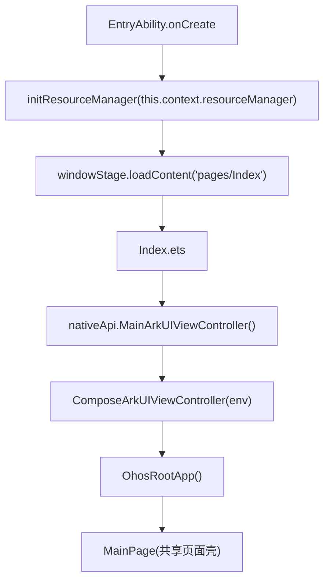

# 环境搭建与基础架构介绍

## 1. 开发环境

推荐环境：

- macOS `aarch64`
- Android Studio
- DevEco Studio
- Xcode
- JDK 17

当前机器环境（2026-04-11）：

- 默认 `java`：JDK `21.0.8` LTS
- 已安装 JDK 17：`17.0.18`
- Xcode：`15.3`
- Xcode Build version：`15E204a`

Harmony 基线：

- `compatibleSdkVersion = 5.0.5(17)`
- `targetSdkVersion = 6.0.0(20)`
- `abiFilters = ["arm64-v8a"]`

版本基线：

- Kotlin `2.2.21-OH.0.1.0-03`
- Compose Multiplatform Plugin `1.9.2-OH.0.1.2-17`
- Compose UI `1.9.2-0H.0.1.2-09`
- Compose Material3 `1.9.2-OH.0.1.2-09`
- AGP `8.6.0`

## 2. 工程目录

常见目录：

```text
project-root/
├── composeApp/
├── harmonyApp/
├── iosApp/
├── docs/
├── gradle/
├── settings.gradle.kts
└── build.gradle.kts
```

模块职责：

- `composeApp/`
  KMP 主模块；负责共享 UI、多平台 sourceSet、OHOS native 产物。
- `harmonyApp/`
  Harmony 宿主；负责 ArkTS 页面、NAPI Bridge、HAP 打包。
- `iosApp/`
  iOS 宿主。

## 3. SourceSet 分层

结构：

```text
commonMain
├── androidMain
├── iosMain
│   ├── iosX64Main
│   ├── iosArm64Main
│   └── iosSimulatorArm64Main
└── ohosMain
    └── ohosArm64Main
```

对应目录：

- `composeApp/src/commonMain`
- `composeApp/src/androidMain`
- `composeApp/src/iosMain`
- `composeApp/src/ohosMain`
- `composeApp/src/ohosArm64Main`

职责划分：

- `commonMain`
  共享页面、共享模型、共享资源。
- `ohosMain`
  OHOS 公共桥接能力。
- `ohosArm64Main`
  真机专属页面和真机相关能力。

## 4. 关键文件

启动相关：

- `composeApp/src/ohosMain/kotlin/com/example/cmp_hello/MainArkUIViewController.kt`
- `composeApp/src/ohosArm64Main/kotlin/com/example/cmp_hello/OhosRootApp.ohosArm64.kt`
- `harmonyApp/entry/src/main/ets/entryability/EntryAbility.ets`
- `harmonyApp/entry/src/main/ets/pages/Index.ets`

构建相关：

- `settings.gradle.kts`
- `gradle/libs.versions.toml`
- `composeApp/build.gradle.kts`
- `harmonyApp/entry/build-profile.json5`

## 5. 启动链路



启动步骤：

1. `EntryAbility.ets` 初始化资源管理器。
2. ArkTS 加载 `pages/Index`。
3. `Index.ets` 调用 `libentry.so` 导出的 `MainArkUIViewController()`。
4. `MainArkUIViewController.kt` 返回 Compose controller。
5. `OhosRootApp()` 挂载共享页面和 OHOS 页面。

## 6. 构建链路

关键文件：

- `composeApp/build.gradle.kts`
- `harmonyApp/entry/build-profile.json5`

关键配置：

- 使用 `ohosArm64()`
- 使用 `binaries.sharedLib`
- 输出 `libkn.so`
- 输出 `libkn_api.h`
- 只保留 `arm64-v8a`

关键任务：

```bash
./gradlew :composeApp:compileKotlinMetadata
./gradlew :composeApp:compileDebugKotlinAndroid
./gradlew :composeApp:compileKotlinOhosArm64
./gradlew :composeApp:linkDebugSharedOhosArm64
./gradlew :composeApp:publishDebugBinariesToHarmonyApp
./gradlew :composeApp:publishReleaseBinariesToHarmonyApp
```

产物：

- `composeApp/build/bin/ohosArm64/debugShared/libkn.so`
- `composeApp/build/bin/ohosArm64/debugShared/libkn_api.h`

同步位置：

- `harmonyApp/entry/libs/arm64-v8a/libkn.so`
- `harmonyApp/entry/src/main/cpp/include/libkn_api.h`
