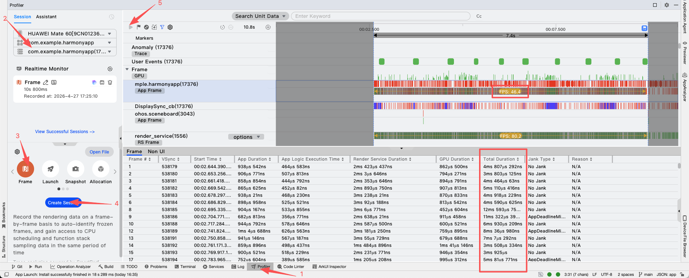
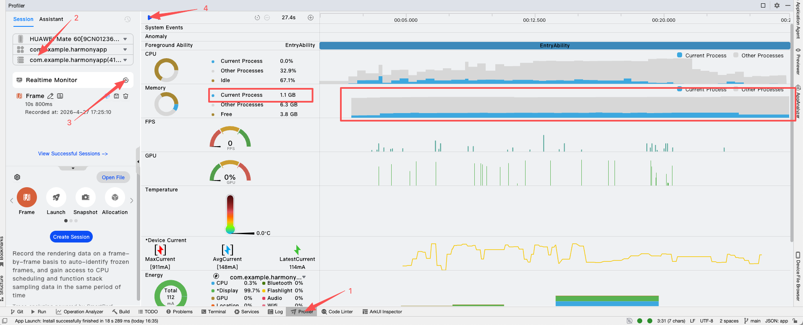

# 所有测试用例步骤说明

## 1. 适用范围

覆盖以下 3 个用例：

| 用例名称                | 页面入口 | 数据来源 |
|---------------------| --- | --- |
| Coil 图片长列表滑动        | `CoilImageListTest` | 本地相册图片 |
| ArkUI（嵌套场景） 图片长列表滑动 | `ArkUiImageListTest` | 本地相册图片 |
| 网络图片长列表滑动           | `InteropListSimple` | 网络图片（picsum） |

## 2. 前置准备

步骤：

1. 手机相册传入 500 张图片备用。
2. 使用Android Studio编译so，`CoilImageListTest` 和 `ArkUiImageListTest` 必须基于 release 产物执行，先在项目根目录执行：

```bash
./gradlew :composeApp:publishReleaseBinariesToHarmonyApp
```

3. 使用DevEco配置签名，运行鸿蒙应用`harmonyApp`

## 3. 通用数据准备（本地相册）

说明：`CoilImageListTest` 和 `ArkUiImageListTest` 共用这一步。

步骤：

1. 打开首页，下滑至 `OHOS` 分组，进入 `ImageListSettings`。
2. 在页面内点击 `选择相册图片`。
3. 在系统相册里选择 500 张测试图片。
4. 返回页面后确认文案显示 `已选 N 张`。
5. 返回页面后确认文案显示 `当前收到 N 条路径`。
6. 视需要点击 `5 列 / 10 列 / 16 列` 调整列数（后续两个本地图片用例会沿用该列数）。

## 4. 用例一：Coil 图片长列表滑动

步骤：

1. 确认已完成“第 2 节”中的 release 发布与安装步骤。
2. 完成“第 3 节 通用数据准备（本地相册）”。
3. 返回首页，进入 `Coil 图片长列表滑动`。
4. 在网格列表中连续上滑和下滑。
6. 观察是否出现白块、明显卡顿、闪退、无法继续滑动等异常。

预期结果：

1. 页面可正常加载已选择的本地图片。
2. 连续滑动过程中**无**崩溃、无卡顿、掉帧。
3. 返回首页后可再次进入并继续滑动。

参考观测（示例）：

使用DevEco的Profiler工具



| 列数 | 进入页面延迟 | 首批图片加载时间 | 平均帧率(fps) | 最长帧耗时 | 备注 |
| --- | --- | --- | --- | --- | --- |
| 5 | 0s | 0.1s | 119 | 13ms | 非常流畅 |
| 10 | 0s | 0.5s | 94 | 22ms | 较为流畅 |
| 16 | 0s | 1s | 32.3 | 124ms | 较为卡顿 |

## 5. 用例二：ArkUI 图片长列表滑动

步骤：

1. 确认已完成“第 2 节”中的 release 发布与安装步骤。
2. 完成“第 3 节 通用数据准备（本地相册）”。
3. 返回首页，进入  `ArkUI 图片长列表滑动` 。
4. 在网格列表中连续上滑和下滑。
6. 观察是否出现空白项、卡顿、闪退、控件释放异常等问题。

预期结果：

使用DevEco的Profiler工具



1. ArkUI 容器能批量渲染已选择的本地图片。
2. 连续滑动过程中**不出现**卡顿、内存持续上涨，ArkUi 组件不被回收，内存上涨至一定程度被系统杀死闪退。
3. 退出页面，对比进入时的内存无上涨。

## 6. 用例三：网络图片长列表滑动

步骤：

1. 确认设备网络可用。
2. 返回首页，进入 `网络图片长列表滑动`。
3. 在网络图片列表中快速地连续上滑和下滑。

预期结果：

1. 网络正常时图片可逐步加载显示，**不会**因为速度过快导致后续所以图片都无法加载，显示图片加载失败。

